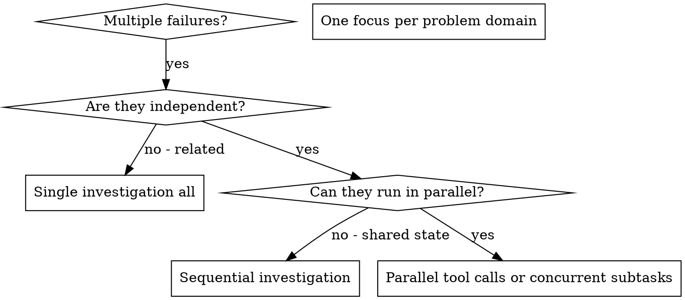

# Dispatching Parallel Agents

## Overview

When you have multiple independent problems (different test files, different subsystems, different bugs), investigating them sequentially wastes time. Each investigation is independent.

**Core principle:** Use parallel tool calls or isolated sequential task_boundary blocks per independent domain. Let investigations happen concurrently when there are no conflicts.

## When to Use



**Use when:**
- 3+ test files failing with different root causes
- Multiple subsystems broken independently
- Each problem can be understood without context from others
- No shared state between investigations

**Don't use when:**
- Failures are related (fix one might fix others)
- Need to understand full system state
- Changes would edit the same files

## The Pattern (Antigravity)

In Antigravity, "parallel dispatch" means:

### Option A: Parallel Tool Calls
When investigations are purely read-only (no writes), use **parallel `view_file`, `grep_search`, `run_command`** calls in a single tool block. Results come back simultaneously, saving time.

```
# Call these simultaneously (in one tool block):
view_file(test_file_a.ts)
view_file(test_file_b.ts)
grep_search(error_pattern, file_c)
```

### Option B: Sequential Focused Blocks
When each domain needs write operations or fixes, address them one domain at a time using separate `task_boundary` sub-phases:

```
[task_boundary: "Fixing Domain A: tool-abort tests"]
  → Investigate
  → Fix
  → Verify

[task_boundary: "Fixing Domain B: batch-completion tests"]
  → Investigate
  → Fix
  → Verify
```

### 1. Identify Independent Domains

Group failures by what's broken:
- File A tests: Tool approval flow
- File B tests: Batch completion behavior
- File C tests: Abort functionality

### 2. Create Focused Investigation Tasks

Each domain investigation needs:
- **Specific scope:** One test file or subsystem
- **Clear goal:** Understand root cause, fix, verify
- **Constraints:** Don't change other areas
- **Expected output:** Summary of what was found and fixed

### 3. Review and Integrate

After solving all domains:
- Verify fixes don't conflict
- Run full test suite
- Confirm all domains resolved

## Common Mistakes

**❌ Too broad:** "Fix all the tests" — scope too wide
**✅ Specific:** "Fix agent-tool-abort.test.ts" — focused

**❌ No constraints:** Might refactor everything
**✅ Constraints:** "Only fix tests in this specific file"

**❌ Overlapping edits:** Two domains editing shared code
**✅ Check first:** Ensure no shared files before parallelizing

## When NOT to Use

- **Related failures:** Fixing one might fix others — investigate together first
- **Need full context:** Understanding requires seeing entire system
- **Shared state:** Changes would write to same files or resources

## Verification

After addressing all domains:
1. **Review each fix** — Understand what changed in each domain
2. **Check for conflicts** — Did any domains edit the same code?
3. **Run full suite** — Verify all fixes work together
4. **Spot check** — Systematic errors can span domains
