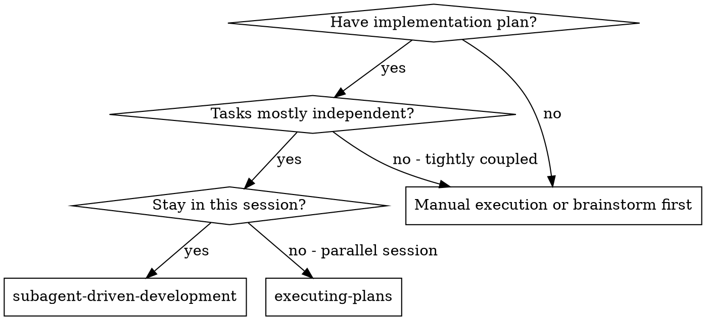
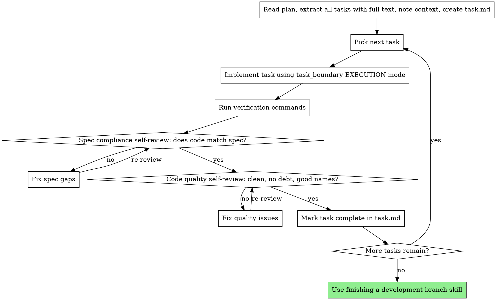

# Subagent-Driven Development

Execute plan by dispatching fresh browser subagents or breaking work into isolated task boundaries per task, with two-stage review after each: spec compliance review first, then code quality review.

**Core principle:** Fresh context per task + two-stage review (spec then quality) = high quality, fast iteration

## When to Use

## The Process (Antigravity)

In Antigravity, you manage the orchestration loop directly:

## In Antigravity: How to Orchestrate

Since you are the orchestrator in Antigravity (rather than spawning separate agent processes), follow this pattern per task:

1. **Announce:** "Implementing Task N: [description]"
2. **Set task_boundary to EXECUTION mode** for this specific task
3. **Implement** following the plan step-by-step (use TDD skill)
4. **Verify:** Run all commands specified in plan, check output
5. **Spec Review:** Re-read the task spec. Does code do exactly what spec says? Nothing more, nothing less?
6. **Quality Review:** Is the code clean? Good names? No magic numbers? No duplication?
7. **Fix and re-verify** if either review fails
8. **Update task.md** marking the task complete
9. **Move to next task**

## Prompt Templates for Reference

The original prompt templates are in this directory:
- `./implementer-prompt.md` — Use as a self-checklist when implementing each task
- `./spec-reviewer-prompt.md` — Use as a spec compliance checklist  
- `./code-quality-reviewer-prompt.md` — Use as a code quality checklist

## Red Flags

**Never:**
- Start implementation on main/master branch without explicit user consent
- Skip spec compliance review before quality review
- Proceed with unfixed issues
- Make parallel changes that could conflict

**Always:**
- Read the full task description from the plan (don't rely on memory)
- Run verification commands after implementation
- Complete spec review BEFORE quality review (order matters)
- Fix issues from each review before moving to next task

## Integration

**Required workflow skills:**
- **using-git-worktrees** — REQUIRED: Set up isolated workspace before starting
- **writing-plans** — Creates the plan this skill executes
- **requesting-code-review** — Code review checklist for each task
- **finishing-a-development-branch** — Complete development after all tasks
- **test-driven-development** — Follow TDD for each implementation step
